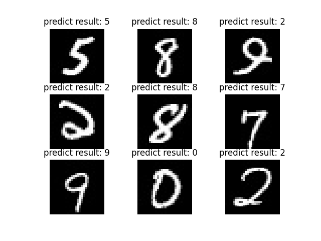

# lenet-on-mnist

This is a pytorch implementation of LeNet handwritten digit recognition model.

## About Model

The model implementation and the parameters used to create the model layers (convolutional layers, fully connected layers, etc.) are seperated into two files for the convinience of modifying model layers. Model implementation resides in model.py, and parameters are in config.yaml.

## About Dataset

This repository uses the CSV format redistributions of MNIST dataset, which can be downloaded in https://www.kaggle.com/datasets/oddrationale/mnist-in-csv.  
  

For training purpose you can just use the csv file since the data has already been organized, but for inference you may find it useful to hava images at hand. Functions involving parsing csv file to images and inferencing reside in utils.py.  
  

After parsing the csv data, the dataset files should be structured like below. Different digit images go into different corresponding subdirectories.
```bash
└── MNIST
    ├── csv
    │   ├── mnist_test.csv
    │   └── mnist_train.csv
    ├── test
    │   ├── 0
    │   │   ├── 0000.jpg
    │   │   └── ...
    │   ├── 1
    │   │   ├── 0000.jpg
    │   │   └── ...
    │   ├── ...
    │   └── 9
    │       ├── 0000.jpg
    │       └── ...
    └── train
        ├── 0
        │   ├── 0000.jpg
        │   └── ...
        ├── 1
        │   ├── 0000.jpg
        │   └── ...
        ├── ...
        └── 9
            ├── 0000.jpg
            └── ...
```

## Package Requirements

The code works on my machine with the following packages installed.

- matplotlib `3.5.1`
- numpy `1.22.3`
- opencv-python `4.5.5.64`
- pandas `1.2.4`
- progressbar2 `4.0.0`
- PyYAML `6.0`
- torch `1.8.2`

## Get Started

First download dataset from the website described above into a subfolder (be aware of the hard-coded path in the code, you may need to modify them). Then just execute train.py, if everything works fine, you will get a "saves.pth" file in the folder. (By the way I already uploaded the file, you can use it directly)  

That's the training part. For inference, use the "parse_data" function in utils.py to convert dataset into folders of images, then use "inference" function to plot test images on a pop up window with the predicted results as titles.  



Happy hacking.